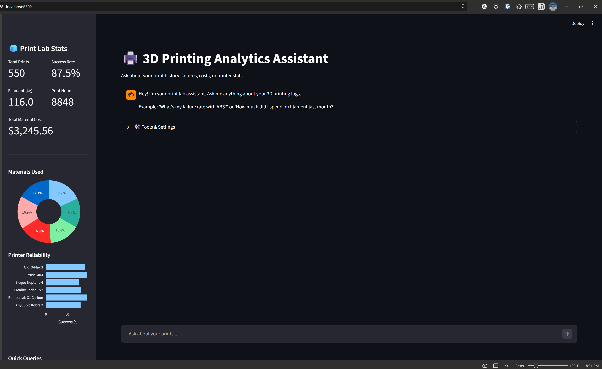
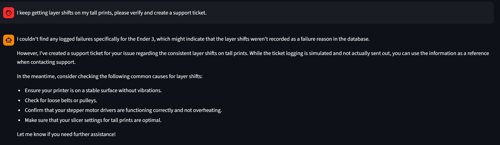

# 3D Print Analytics Agent 🖨️

I built this tool to help me track my 3D printing projects, analyze failures, and figure out how much money I'm actually spending on filament. It uses an AI agent to query my print logs so I can ask questions like "Why does my PETG keep failing?" or "Show me my most expensive prints".

## Features

- **Print Tracking**: Database of all my print jobs (success/fail, material, time, settings).
- **AI Assistant**: Chat interface to query data without writing SQL.
- **Cost Analysis**: Tracks filament usage and cost per print.
- **Visuals**: Dashboard with success rates, material breakdown, and printer reliability charts.
- **Support Logging**: Can "open a ticket" for complex failures (mostly for tracking/logging purposes).

## Setup

1. **Install requirements**
   ```bash
   pip install -r requirements.txt
   ```

2. **Environment**
   You need an OpenAI API key for the agent.
   ```bash
   # create .env file
   OPENAI_API_KEY=sk-...
   ```

3. **Generate Data**
   I wrote a script to generate realistic dummy data (since I can't share my actual meaningful logs).
   ```bash
   python src/database_setup.py
   ```
   This creates `data/print_analytics.db` with ~550 print jobs.

4. **Run the App**
   ```bash
   streamlit run app.py
   ```

## Workflow

### Tracking Prints
I log everything: printer used (Bambu, Prusa, Ender), material (PLA, ASA, etc), and the outcome. If it fails, I log the reason (layer shift, clog, etc).

### Asking Questions
The agent is pretty good at aggregation. I usually ask:
- "What's my success rate on the Ender 3?"
- "How much filament did I waste on failed prints last month?"
- "Is Prusament worth the extra cost vs eSun?" (It checks failure rates)

### Dashboard
The sidebar gives me a quick look at my totals. I like seeing the "Total Filament (kg)" go up (or cry when I see total cost).


## Usage Report

Here is a glimpse into how the analytics agent helps track and improve 3D printing workflows.

### 1. Dashboard Overview
The main dashboard gives a high-level view of printer performance, material usage, and overall costs.



### 2. Conversational Analytics
Instead of writing complex SQL, I can just ask the AI about specific trends or failure patterns.


### 3. Detailed Logs
The app maintains a full history of every print job, allowing for easy auditing of settings and materials.


### 4. Failure Deep-Dive
One of the most useful features is identifying *why* certain printers or materials fail more often than others.



### 5. Cost & Material Tracking
Seeing the actual cost per print helps in deciding which filaments are best for which projects.


## Tech Stack
- **Python** & **Streamlit** for the UI.
- **SQLite** for the database (simple, local).
- **OpenAI GPT-4o-mini** for the reasoning/SQL generation.
- **Plotly** for the charts.

Enjoy! 🎨
