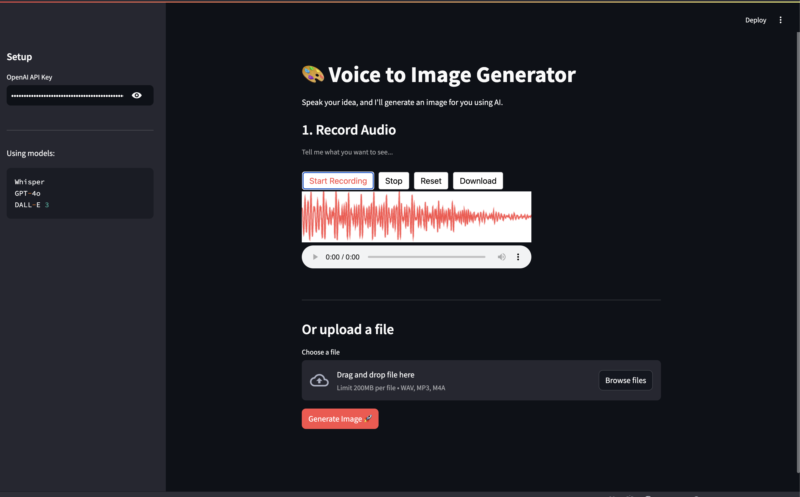
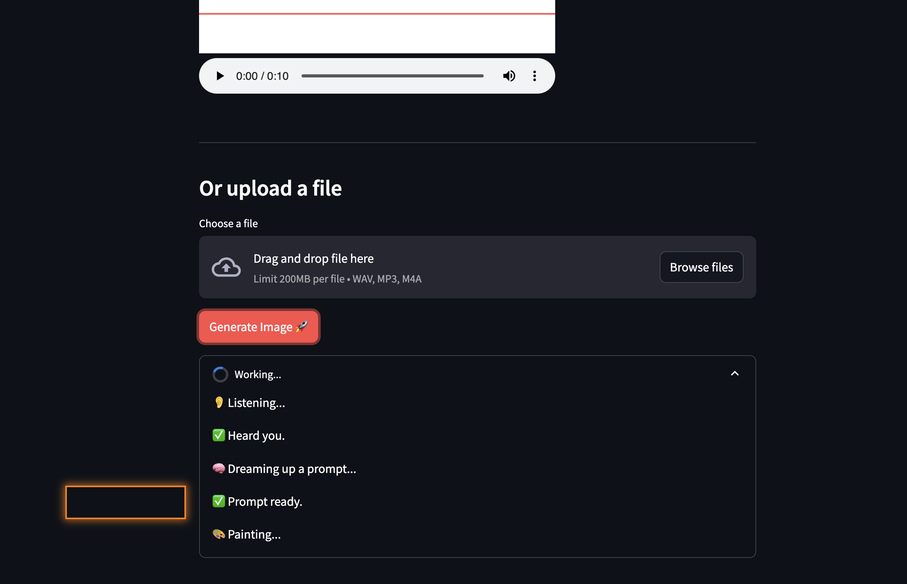
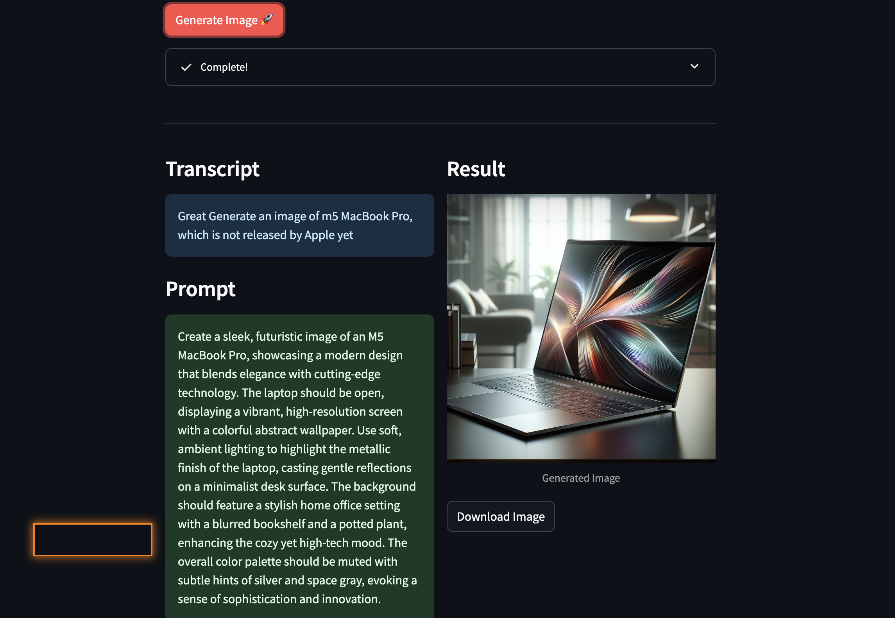
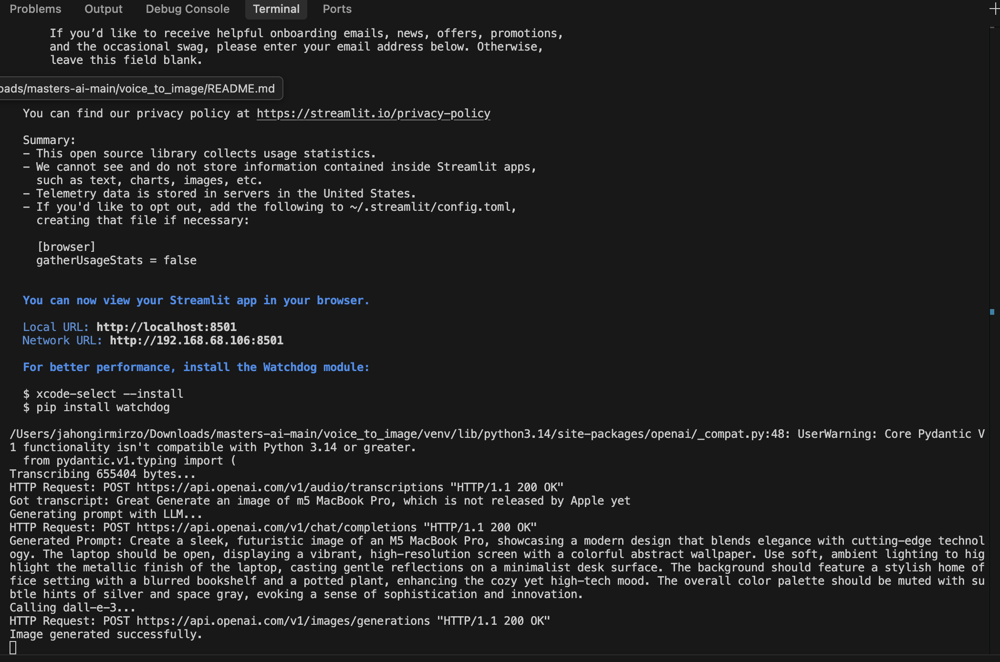

# Voice -> Image App

Hey! This is a simple app that takes your voice recording, transcribes it, and turns it into an AI-generated image. I built this to test out the OpenAI pipeline (Whisper + GPT + DALL-E).

## How it works

1. **Whisper** hears your audio and converts it to text.
2. **GPT-4o** takes that text and writes a better prompt for the image generator.
3. **DALL-E 3** generates the final image.

## Setup

You'll need an OpenAI API key.

### Run with Docker (Recommended)

Just run:
```bash
docker compose up --build
```
Then go to `http://localhost:8501`.

### Run locally

If you want to run it without Docker:

```bash
# Setup venv
python -m venv venv
source venv/bin/activate

# Install deps
pip install -r requirements.txt

# Run
streamlit run app.py
```


## Usage Report

Here is a quick walkthrough of the app in action:

### 1. Recording
We start by recording a voice message or uploading a file.



### 2. Processing
The agent listens (Whisper), thinks (GPT-4o), and draws (DALL-E 3).



### 3. Results
The final output shows the transcript, the enhanced prompt, and the generated image.



### Console Logs
You can see the agent's internal thought process in the terminal logs.



## Stuff used

- Python 3.12
- Streamlit
- OpenAI API
- Docker

Enjoy! 🎨
